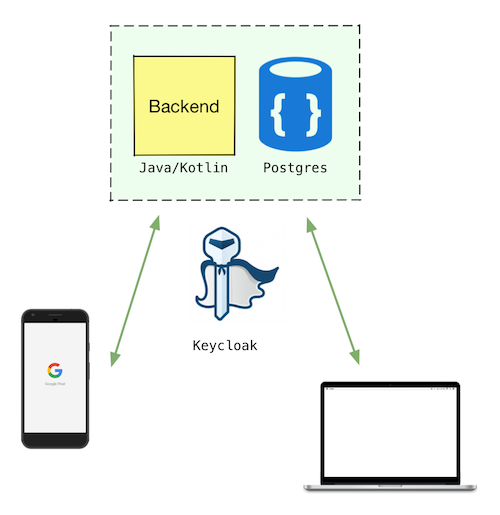

# =barkoder=
a minimalistic WMS system

[](https://travis-ci.org/maslick/barkoder)
[](https://cloud.docker.com/u/maslick/repository/docker/maslick/barkoder)
[](https://codeclimate.com/github/maslick/barkoder/maintainability)
[](https://codecov.io/gh/maslick/barkoder)
[  ](https://bintray.com/maslick/maven/barkoder/_latestVersion)
[](https://opensource.org/licenses/MIT)




## Features
* simple REST API
* OAuth2.0 by Keycloak (optional)
* written in Kotlin
* SpringBoot v2
* Android native [client](https://github.com/maslick/kodermobilj)
* Web [client](https://github.com/maslick/barkoder-ui)
* Heroku deployment
* Docker image on Dockerhub
* Docker-compose configuration
* Openshift deployment
* Kubernetes descriptors

## Installation (local)
```
$ git clone https://github.com/maslick/barkoder.git
$ ./gradlew clean build
```

or simply download the artifact from ``bintray``:
```
$ wget -O barkoder-0.4.jar https://bintray.com/maslick/maven/download_file?file_path=io/maslick/barkoder/0.4/barkoder-0.4.jar
```

## Usage (local)
Create the file ``application.properties`` and put it in the same directory as the jar:
```
# Db
spring.datasource.platform=postgres
spring.datasource.url=jdbc:postgresql://${PGHOST}:5432/${PGDATABASE}?sslmode=disable
spring.datasource.username=${PGUSER}
spring.datasource.password=${PGPASSWORD}

spring.jpa.properties.hibernate.temp.use_jdbc_metadata_defaults=false
spring.jpa.database-platform=org.hibernate.dialect.PostgreSQL9Dialect
spring.datasource.driver-class-name=org.postgresql.Driver
spring.jpa.hibernate.ddl-auto=update

# OAuth2.0
keycloak.auth-server-url=${KCHOST}/auth
keycloak.resource=${CLIENT}
keycloak.realm=${REALM}
keycloak.bearer-only=true
keycloak.ssl-required=external
keycloak.credentials.secret=${CLIENT_SECRET}
keycloak.cors=true
keycloak.enabled=${KC_ENABLED:false}

keycloak.securityConstraints[0].securityCollections[0].name=secured stuff
keycloak.securityConstraints[0].authRoles[0]=${CLIENT_ROLE}
keycloak.securityConstraints[0].securityCollections[0].patterns[0]=/*
```
Run the service:
```
$ java -jar barkoder-0.4.jar
```

## API
* List all Items: ``GET /items``
* Get an Item by its id: ``GET /item/{id}``
* Get an Item by its barcode: ``GET /barcode/{barcode}``
* Add new Item: ``POST /item``
* Add multiple Items: ``POST /items``
* Update an Item: ``PUT /item``
* Delete an Item by its id: ``DELETE /item/{id}``
* Delete an Item by its barcode: ``DELETE /barcode/{barcode}``

For the payload use the ``application/json`` MIME type (UTF-8).

If the REST API is secured with ``Keycloak``, an ``Authorization`` header should be present in each request:
```
"Authorization" : "bearer ${KEYCLOAK_TOKEN}"
```

## Entity
``Item``:
```
{
  "id": 1
  "title": "Union Lager",
  "category": "beer",
  "description": "Full flavour, medium bitterness",
  "barcode": "5901234123457",
  "quantity": 1
}
```

``Response``:
```
{
  "status": "OK",
  "errorMessage": null
}
```

## Docker-compose
This [configuration](deployment/docker-compose.yml) contains three containers: frontend, backend, database. Edit environment variables according to your setup and then run: 

```bash
cd deployment
docker-compose up -d 
```

## Heroku
```
heroku login
git clone https://github.com/maslick/barkoder.git koder && cd koder
heroku create my-barkoder
heroku addons:create heroku-postgresql:hobby-dev
heroku config:set \
  KC_ENABLED=true \
  KCHOST=https://keycloak.io \
  REALM=barkoder \
  CLIENT=barkoder-backend \
  CLIENT_SECRET=xxxxxxx-xxxx-xxxx-xxxx-xxxxxxx \
  CLIENT_ROLE=craftroom
git push heroku master
```

## Deploy to Openshift
1. Create a new project
```
oc new-project test
```

2. Deploy database
```
oc new-app -f https://raw.githubusercontent.com/openshift/origin/master/examples/db-templates/postgresql-persistent-template.json \
  -p DATABASE_SERVICE_NAME=barkoder-db \
  -p POSTGRESQL_USER=admin \
  -p POSTGRESQL_PASSWORD=password \
  -p POSTGRESQL_DATABASE=barkoderdb

```

3. Deploy the service
```
oc new-app maslick/barkoder
```

4. Set env. variables
```
oc set env dc/barkoder \
  PGHOST=barkoder-db \
  PGDATABASE=barkoderdb \
  PGUSER=admin \
  PGPASSWORD=password \
  KC_ENABLED=false \
  KCHOST=https://keycloak.io \
  REALM=barkoder \
  CLIENT=barkoder-backend \
  CLIENT_SECRET=xxxxxxx-xxxx-xxxx-xxxx-xxxxxxx \
  CLIENT_ROLE=craftroom
```

5. Expose route
```
oc expose svc/barkoder --port=8080
open http://barkoder-test.apps.example.com/items
```

## Deploy to Kubernetes (GKE)
### 1. Create cluster
```
alias k=kubectl
gcloud projects create barkoder
gcloud projects list
gcloud config set project barkoder

gcloud container clusters create barkoder-cluster --zone=europe-west3-a --machine-type=n1-standard-1 --num-nodes=2 --preemptible
gcloud container clusters get-credentials barkoder-cluster --zone europe-west3-a --project barkoder
gcloud container clusters resize barkoder-cluster --size 4
```

### 2. Configure ingress
```
# install tiller
k create serviceaccount tiller --namespace kube-system
k create clusterrolebinding tiller-cluster-rule --clusterrole=cluster-admin --serviceaccount=kube-system:tiller
helm init --service-account tiller
k get pods --namespace kube-system

# Install Nginx Ingress controller
helm install stable/nginx-ingress \
  --name barkoder-nginx \
  --set rbac.create=true \
  --namespace kube-system

# Make nginx-ingress ip static (GKE)
NAMESPACE=kube-system
IP_ADDRESS=$(k describe service barkoder-nginx-nginx-ingress-controller --namespace=$NAMESPACE | grep 'LoadBalancer Ingress' | rev | cut -d: -f1 | rev | xargs)
gcloud compute addresses create k8s-static-ip --addresses $IP_ADDRESS --region europe-west3

# Add DNS A records referencing $IP_ADDRESS with your DNS registrar
```

### 3. Configure SSL certificates
```
# Install cert-manager
helm install stable/cert-manager \
  --namespace kube-system \
  --set ingressShim.defaultIssuerName=letsencrypt-prod \
  --set ingressShim.defaultIssuerKind=ClusterIssuer \
  --version v0.5.2
  
# Create a cert issuer
cat <<EOF | k apply -f -
apiVersion: certmanager.k8s.io/v1alpha1
kind: ClusterIssuer
metadata:
  name: letsencrypt-prod
  namespace: default
spec:
  acme:
    email: pavel.masloff@gmail.com
    server: https://acme-v02.api.letsencrypt.org/directory
    privateKeySecretRef:
      name: letsencrypt-prod
    http01: {}
EOF
k describe clusterissuer letsencrypt-prod
```

### 4. Deploy database
```
helm install \
  --name barkoder-db \
  stable/postgresql \
  --set "postgresqlUsername=barkoder" \
  --set "postgresqlPassword=password" \
  --set "postgresqlDatabase=barkoderdb"
```

### 5. Deploy barkoder
```
# Create ingress
k apply -f k8s-barkoder-ingress.yaml

# Create deployment and service
k apply -f k8s-barkoder-api.yaml
k apply -f k8s-barkoder-web.yaml

# Apply configuration changes (optional)
k set env deploy/barkoder-web BACKEND_URL=https://koder-api.maslick.ru
k set env deploy/barkoder-api \
  PGHOST=barkoder-db-postgresql \
  PGDATABASE=barkoderdb \
  PGUSER=barkoder \
  PGPASSWORD=password \
  SSLMODE=disable \
  CLIENT_SECRET=xxx-xx-xx
```

### 6. Run the app
```
open https://koder.maslick.ru
```